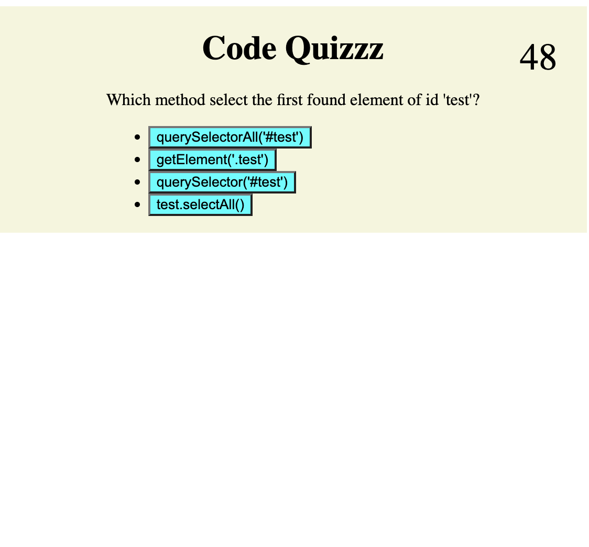

# 04 Web APIs: Code Quiz

## Joining javascript and html

This quiz displays multiple choise questions for the user to answer. Once a user clicks start, a timer counts down. Once the timer hits zero, or if all questions are answered, the game is over. A score is then displayed, and the user can input their name to store the score to local storage for the next visit.

# Live demo
* https://chicken1991.github.io/code-quiz/

# Github repo
* https://github.com/chicken1991/code-quiz.git

## Mockup

